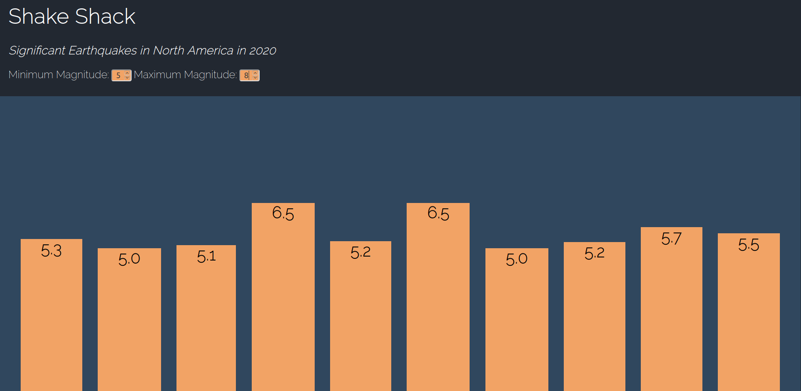

# shake-shack-components

A React-enabled visualization of 2020 earthquake data in North America from [USGS Earthquake Catalog API](https://earthquake.usgs.gov/fdsnws/event/1/)

## Parameters
The user can modify the `minmagnitude` and `maxmagnitude` parameters by using the inputs.

The following other parameters were used to retrieve the displayed data:

`starttime`: 2020-01-01

`minlatitude`: 24.396308

`minlongitude`: -124.848974

`maxlatitude`: 49.384358

`maxlongitude`: -66.885444

The current date is retrieved from the browser and submitted as the `endtime` parameter.
